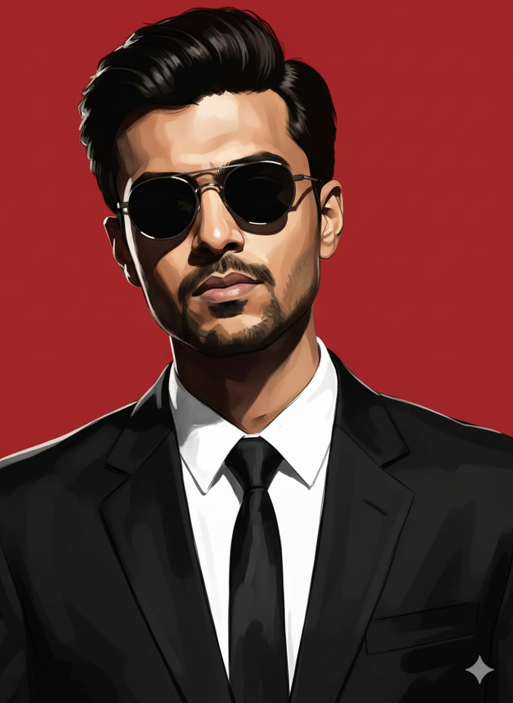
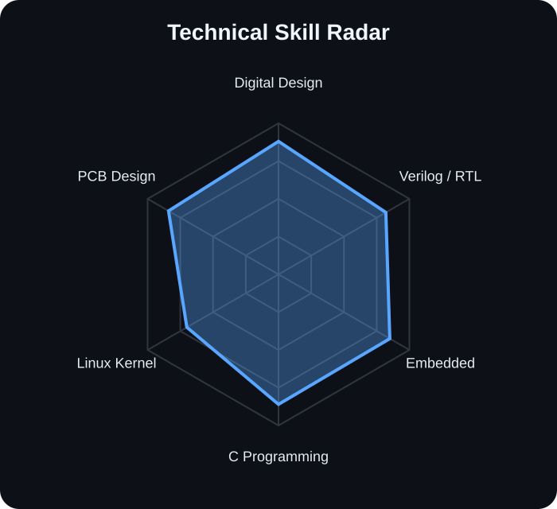
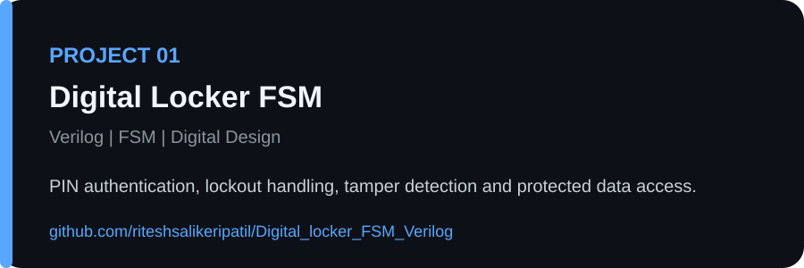
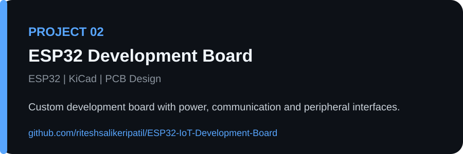
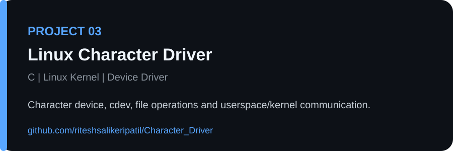
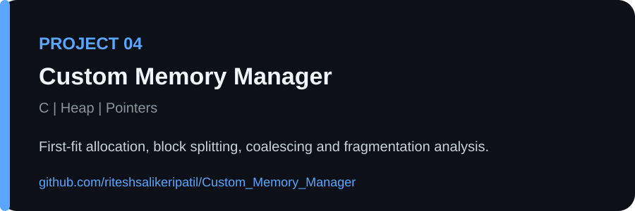
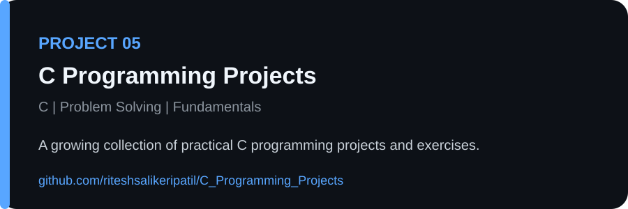
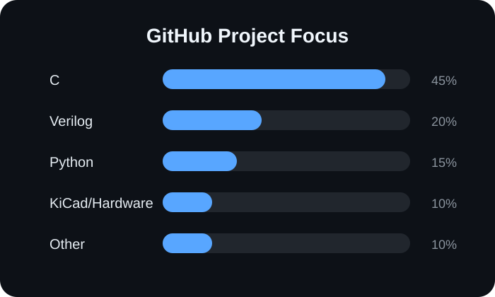

<div align="center">



# Ritesh Salikeri Patil

### Electronics & Communication Engineering Student

**VLSI & Digital Design • Embedded Systems • Linux Kernel • PCB Design**

<p>
  <a href="https://github.com/riteshsalikeripatil"></a>
  <a href="https://www.linkedin.com/in/ritesh-salikeri-patil-82433b358/"></a>
  <a href="mailto:riteshsalikeripatil11@gmail.com"></a>
</p>

</div>

---

## 👨‍💻 About Me

I am an Electronics and Communication Engineering student interested in **Digital Design, Verilog/RTL, Embedded Systems, C Programming, Linux Kernel Development and PCB Design**.

I enjoy building practical projects that help me understand how hardware and software work together at the system level.

### 🎯 Current Focus

- Digital Design and VLSI
- Verilog and FSM-based RTL Design
- Embedded Hardware and Microcontrollers
- C Programming and Memory Management
- Linux Kernel and Character Device Drivers
- KiCad Schematic and PCB Design

---

## 🛠️ Technical Skills

<p>


</p>

### Digital Design & VLSI
Verilog • RTL Design • FSM • Combinational Logic • Sequential Logic • Vivado

### Embedded Systems
ESP32 • ESP8266 • ATmega328P • UART • SPI • I2C • Sensor Interfacing

### Linux & Low-Level Development
Linux • Kernel Modules • Character Device Drivers • file_operations • Make

### Hardware & PCB Design
KiCad • Schematic Design • PCB Layout • Microcontroller Boards • Power Design

---

## 📊 Technical Skill Radar

<div align="center">

</div>

---

## 🚀 Featured Projects

### 01. Digital Locker FSM

[](https://github.com/riteshsalikeripatil/Digital_locker_FSM_Verilog)



---

### 02. ESP32 IoT Development Board

[](https://github.com/riteshsalikeripatil/ESP32-IoT-Development-Board)



---

### 03. Linux Character Driver

[](https://github.com/riteshsalikeripatil/Character_Driver)



---

### 04. Custom Memory Manager

[](https://github.com/riteshsalikeripatil/Custom_Memory_Manager)



---

### 05. C Programming Projects

[](https://github.com/riteshsalikeripatil/C_Programming_Projects)



---

## 💻 Project Focus

<div align="center">

</div>

---

## 📈 GitHub Activity

<div align="center">


</div>

---

## 🐍 Contribution Activity

The contribution snake is generated automatically by GitHub Actions after the workflow runs.

<div align="center">

</div>

---

## 🎯 Engineering Direction

```text
Digital Design & VLSI
        ↓
Verilog / RTL / FSM
        ↓
Embedded Hardware
        ↓
C Programming
        ↓
Linux Kernel / Drivers
        ↓
PCB Design
```

<div align="center">

### Thanks for visiting my profile 👋

</div>
